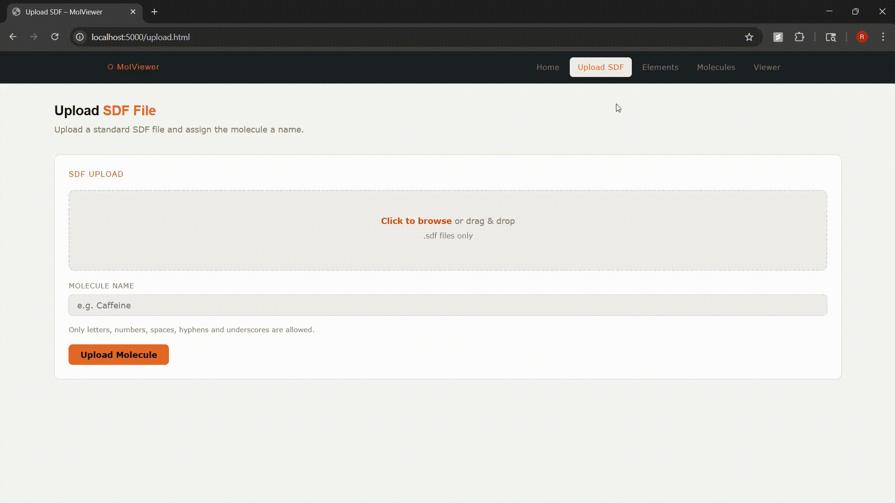
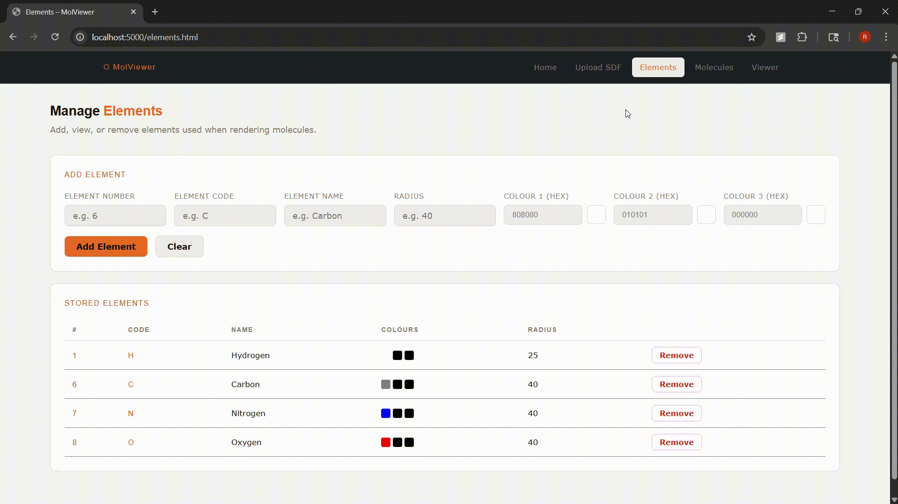
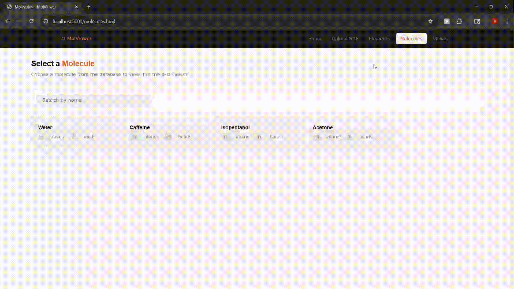
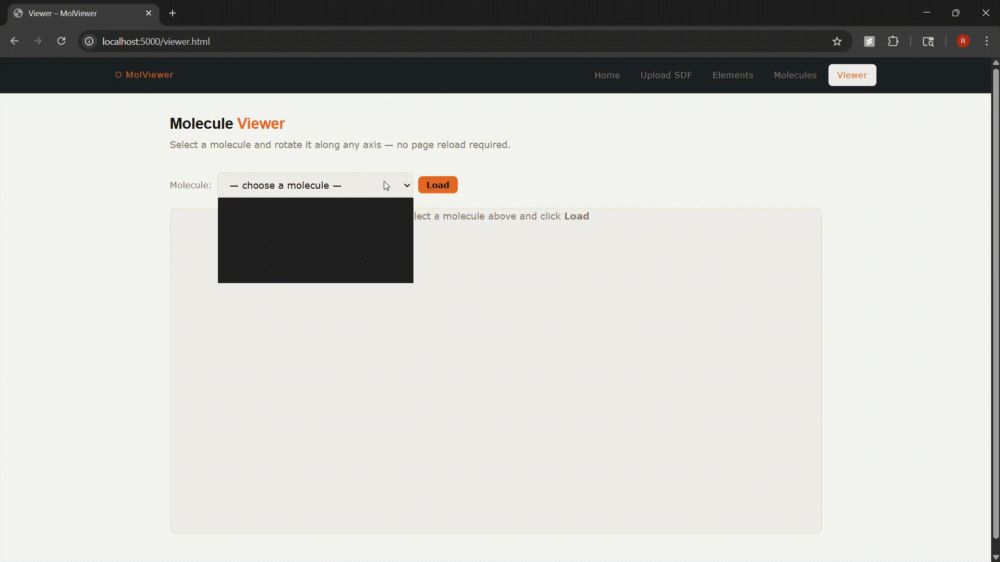
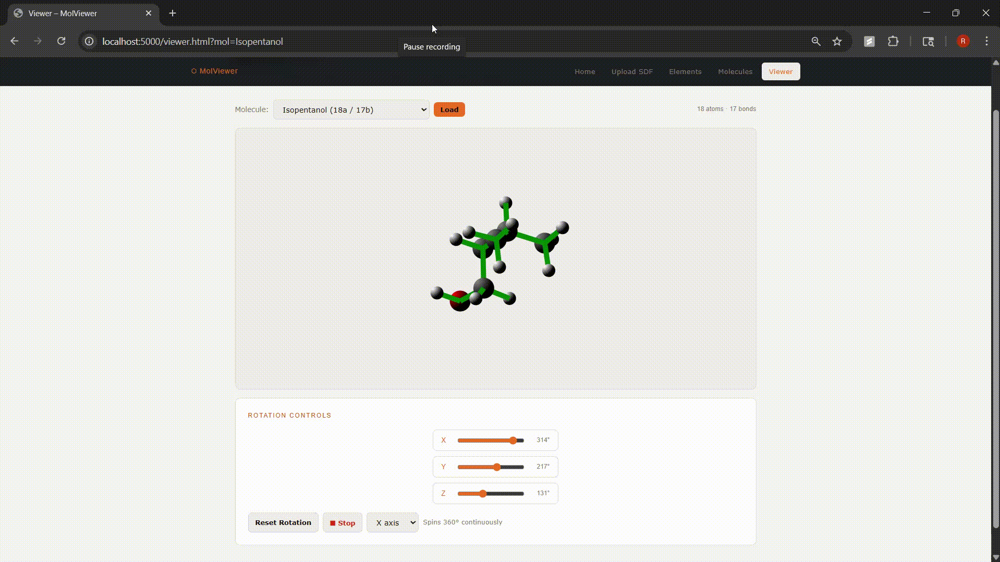
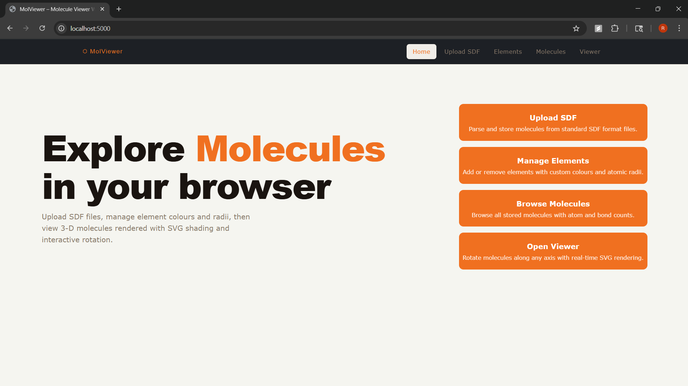
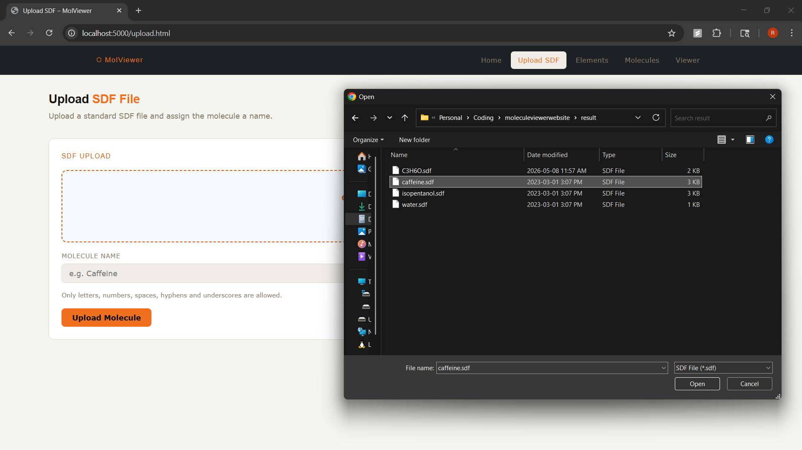
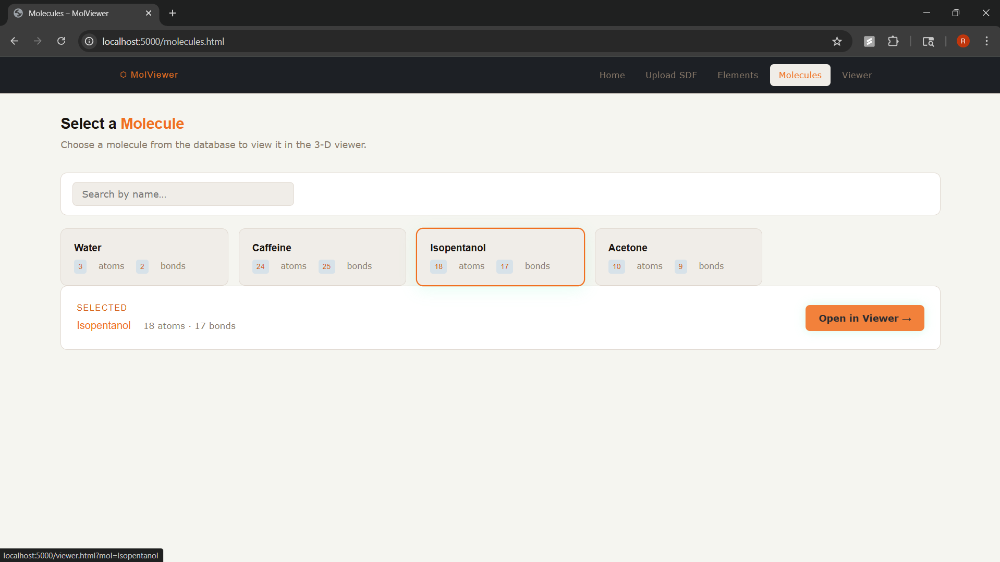
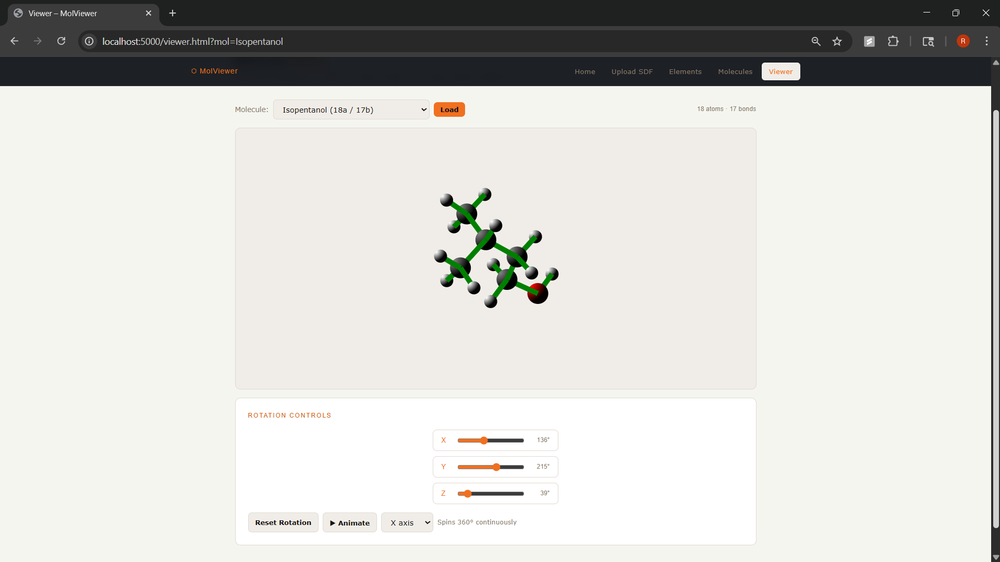

# 3D Molecule Viewing Website
Developed a full-stack web application for uploading, rendering and interacting with 3D Molecular Structures using SVG graphics in the browser. The project emphasized backend development, frontend integration, database management, and scientific visualization.

## Tech Stack
- **C** — Core backend implementation and Molecule data structures.
- **Python** — Backend/frontend integration, SVG generation, and database interaction.
- **SWIG** — Used to connect the C backend with Python.
- **SQL** — Storage and management of molecular data.
- **HTML, CSS, JavaScript** — Frontend interface and user interaction.

## Features
### Upload SDF Files
Upload SDF files of Molecules to the website, which are saved into an SQL database.

### Add Elements
Add and remove chemical elements to personalize the molecular viewing experience. You can choose the colour and size of each element as you upload them to the database. The Database starts with Hydrogen, Carbon, Nitrogen and Oxygen but users may add and customize element colours and size as they see fit.

### Organize Molecules
View the selection of Molecules that have been uploaded to the Database. Click on any molecule to view it in the 3D Molecule Viewer.

### 3D Viewer
View the Molecule in 3D. You can rotate the molecule to view it from all angles. You may also animate the Molecule, rotating it along a certain axis of your choosing.

## Additional Screenshots

## Note
Source code is private due to university academic integrity policies.
This repository is intended for portfolio/showcase purposes only.
